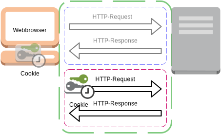

:data-transition-duration: 2000
:skip-help: true
:css: css/campus02.css

.. role:: html(code)
  :language: html

.. _HTTP State Management Mechanism: http://tools.ietf.org/html/rfc6265
.. _https\://campus02.fladi.at/: https://campus02.fladi.at/

.. title: HTTP Cookies

----

HTTP: Cookies
=============

----

Das Problem?
------------

*HTTP ist zustandslos.*

----

Der Zusammenhang
----------------

Wie können dann einzelne HTTP-Verbindungen zu einer gemeinsamen Sitzung
zugeordnet werden?

----

Anwendungsfälle
---------------

Wo wird üblicherweise eine gemeinsame Sitzung über mehrere HTTP-Verbindungen
hinweg benötigt?

* Login/Logout
* Mehrseitige Formulare
* Temporäre Einstellungen (Sprache, ...)
* ...

----

Mögliche Ansätze
----------------

 * IP-Adressen?
 * Browser-Erkennung?
 * Eigenen Header mitschicken?

----

Cookie == HTTP-Header
=====================

----

Der Webserver sendet das Cookie als einen eigenen Header:

.. code:: http

  HTTP/1.1 200 OK
  Set-Cookie: user=SusiSorglos

*Zum Beispiel als Kennzeichnung der Sitzung nach erfolgreichem Login.*

----

Der Webbrowser liest das Cookie aus dem Header aus und legt es in einem lokalen
Speicher ab, der auch nach Abbau der HTTP-Verbindung erhalten bleibt.

----

Der Webbrowser sendet nun bei jedem nachfolgenden Request das zuvor erhaltene
Cookie als Header zurück an den Webserver:

.. code:: http

  GET /secure/path HTTP/1.1
  Cookie: user=SusiSorglos

Dieser kann nun anhand der Daten im Cookie die Zuordnung der Verbindung zu einer
Sitzung treffen.

----

Aufbau
------

.. code:: abnf

  set-cookie = "Set-Cookie:" cookie-str
  cookie-str = NAME "=" VALUE
                *(";" cookie-av)
  cookie-av = "Domain" "=" value
            | "Max-Age" "=" value
            | "Expires" "=" value
            | "Path" "=" value
            | "Secure"
            | "HttpOnly"

----

Sicherheit
----------

Cookies sind sicherheitsrelevante Informationen. Sie dürfen nicht an
unbeteiligte Dritte weitergegeben werden bzw. dürfen nicht zum Schaden des
Benutzers entwendet werden.

Um zu verhindern, dass Cookies **gestohlen** werden, können sie mehreren
Einschränkungen unterliegen.

----

Demo: Cookie-Diebstahl
----------------------

Bitte öffnen Sie `https\://campus02.fladi.at/`_ in Ihrem Webbrowser.

Das zu schützende Cookie in diesem Beispiel ist eine zufällige **Session-ID**
welche vom Webserver bei einem erfolgreichen Login erzeugt wird.

----

Same-Origin-Policy
------------------

 Relevant sind **Domain** und **Path**.

 Beim **Senden** matcht eine Domain auch für Subdomains (alle Level).
 *Ausnahme: Leerer Domain-Parameter matcht nur für den aktuellen Host.*

 Beim **Setzen** kann das Cookie bis auf die Ebene der Hauptdomain gesetzt werden.
 *Ausnahme: Third-Level-Domains wie gv.at, co.uk, ... (abhängig vom Webbrowser)*

----

Secure
------

Das Cookie darf nur über sichere Kanäle (HTTPS) übertragen werden.

----

HttpOnly
--------

JavaScript hat keinen Zugriff auf das Cookie.

----

Referenzen
----------

* Alle HTTP RFCs
* `HTTP State Management Mechanism`_

